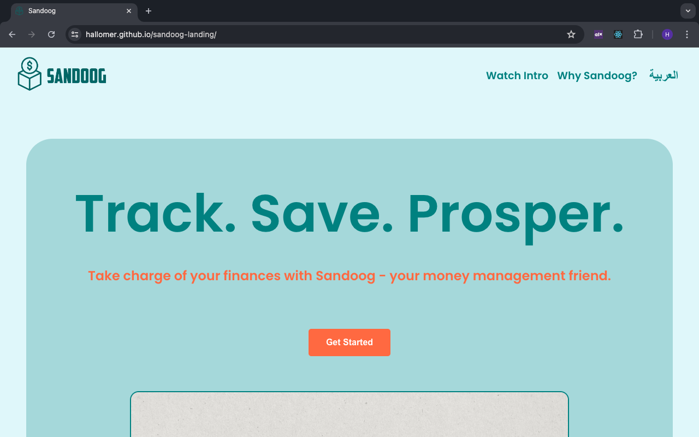
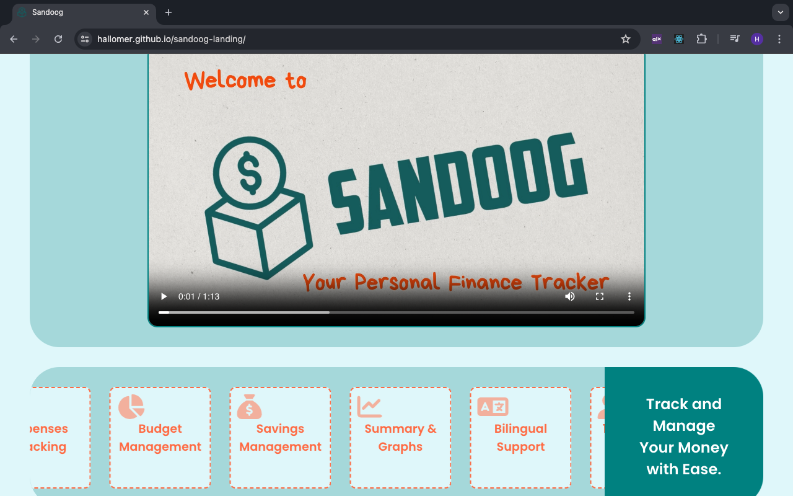
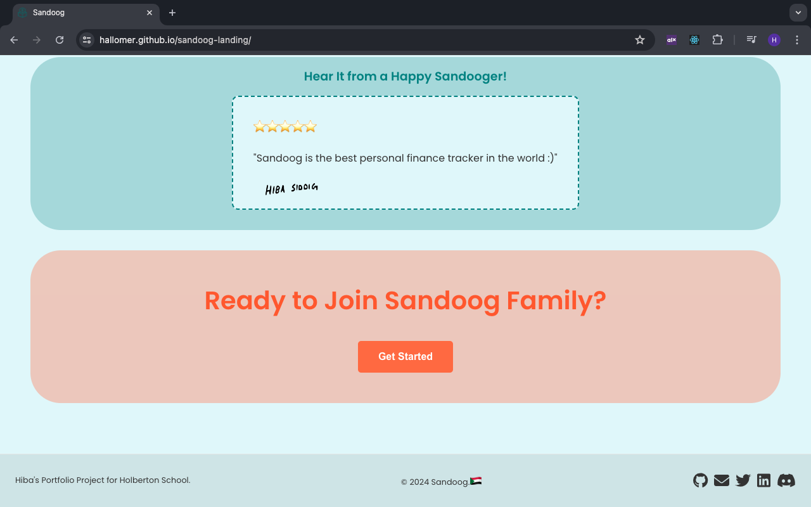

# Sandoog Landing Page


Welcome to the repository for the Sandoog Landing Page! This project serves as the entry point for the Sandoog platform, providing users with key information about the features offered.

Visit the [Sandoog Landing Page](https://hallomer.github.io/sandoog-landing/).

## Screenshots

1. 
2. 
3. 

## Features

- **Bilingual Support**: Easily toggle between English and Arabic.
- **Responsive Design**: Optimized for both desktop and mobile devices.
- **Feature Highlights**: Provides an overview of key features such as income tracking, budget management, and more.
- **Video Introduction**: Embedded video for a quick introduction to the platform.

## Installation

Follow these steps to set up the project locally:

1. **Clone the repository**:
    ```bash
    git clone https://github.com/your-username/sandoog-landing.git
    cd sandoog-landing
    ```

2. **Install dependencies**:
    ```bash
    npm install
    ```

3. **Start the development server**:
    ```bash
    npm start
    ```

Your landing page should now be running on `http://localhost:3000`.

## Usage

- **Changing Language**: Click the language button in the navigation bar to switch between English and Arabic.
- **Viewing Features**: Scroll down or click the "Watch intro" button in the navigation bar to see the highlighted features of the Sandoog platform.
- **Watching the Introduction Video**: Scroll down or click the "Watch intro" button in the navigation bar to take you to the embedded video.

## Translation

The project supports bilingual text using the `react-i18next` library. Translations are located in the `src/locales` directory. To add or update translations, modify the respective JSON files:

- `src/locales/en/translation.json` for English.
- `src/locales/ar/translation.json` for Arabic.

## Contributing

Contributions are welcome! If you encounter any issues or have suggestions for improvements, please open an issue or submit a pull request.

## License
This project is licensed under the [MIT License](LICENSE).
